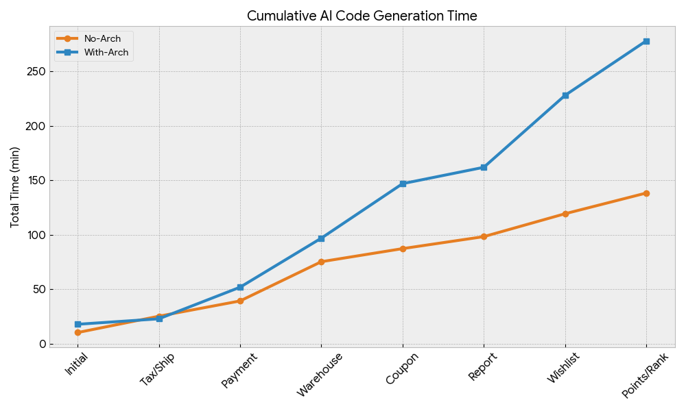
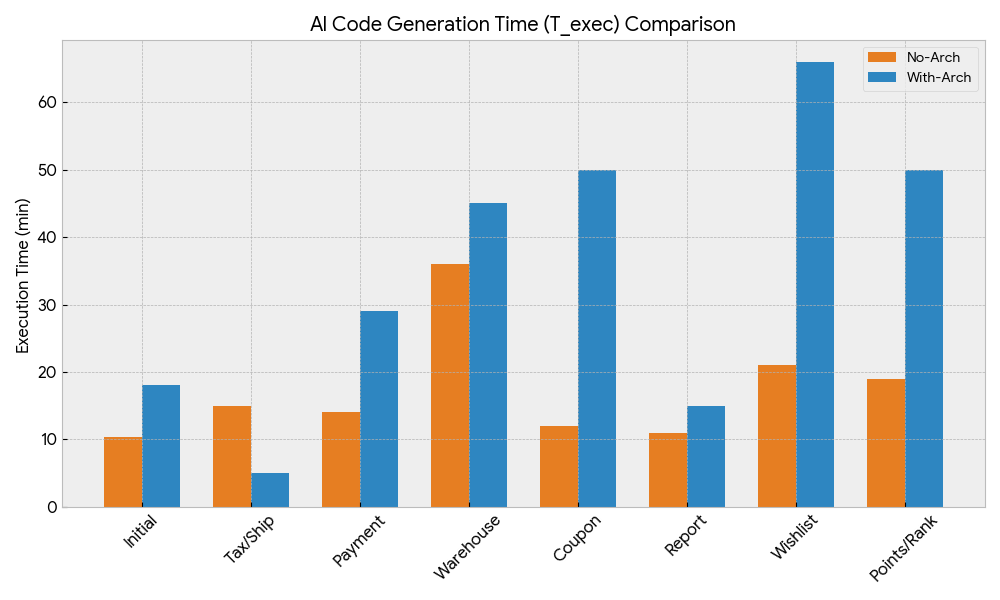
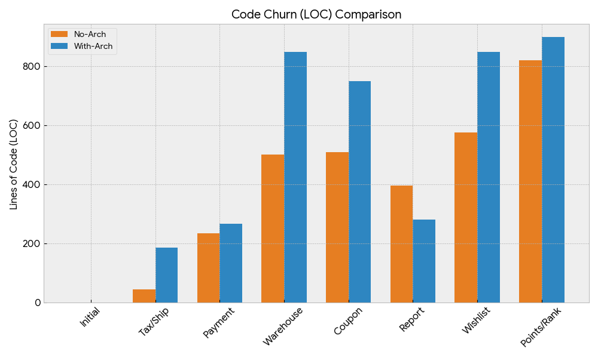
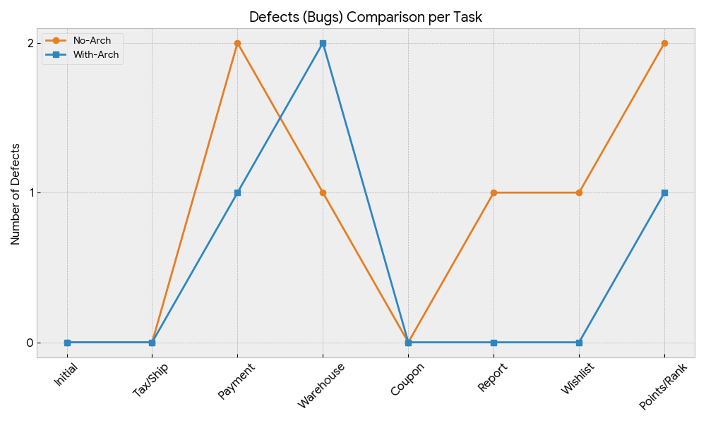
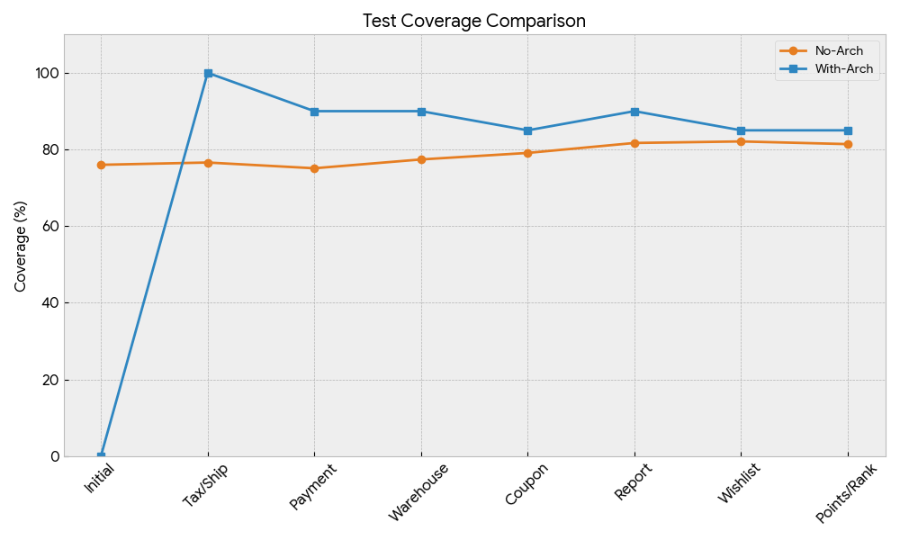

+++
date = '2026-01-25T08:48:01+09:00'
title = 'バイブコーディングとアーキテクチャ'
+++

# バイブコーディングにおけるアーキテクチャの有用性を実験してみた
巷ではよくアーキテクチャがしっかりしてた方がAIを使ったバイブコーディングでも威力を発揮するという話がよくあったのと、自分も業務の方で
PdM的なメンバーで非エンジニアがバイブコーディングで作ったPRをレビューしててなかなか質が上がってこず、アーキテクチャもっとしっかりしてたら
違うのかなーみたいなことを思ってたので、実験してみよう！ということでやってみた記録。
最初に書いておくと、結構のんびりやってるのもあって継続ものになります。
実験してるとあれもやってみたらこれもやってみたら？となることが多いので。

# 実験内容
## リポジトリ
実験してるリポジトリは以下の二つで、アーキテクチャ有無で分けてます
- [アーキテクチャあり](https://github.com/gal1996/vibe_coding_with_architecture)
- [アーキテクチャなし](https://github.com/gal1996/vibe_coding_without_architecture)

## 条件
現時点では以下の内容を実験の条件としています

| topic     | アーキテクチャあり           | アーキテクチャなし           |
|-----------|---------------------|---------------------|
| 開発内容      | ECサイト               | ECサイト               |
| アーキテクチャ   | クリーンアーキテクチャ+DDD     | 全てのコードをmain.goに納める  |
| claude.md | 実験内容や検証方法などのメタ情報を記述 | 実験内容や検証方法などのメタ情報を記述 |
| AIModel   | opus                | opus                |

## 実験方法
大前提なんだけど、個人で適当にやってる実験なので学術的な方法では全くありません。興味本位でやってるだけです。
記録も基本はAIにやらせてるので、細かくは確認してないです。(もちろんある程度は確認してるけどね)

そんな温度感で温かく見てください

### 開発内容の決め方
どんな機能を作るかは、実装で使ってるAIモデルとは別にgeminiを用いて決める。
### 開発内容のプロンプト
開発内容のプロンプトは常にアーキテクチャ有・無で同じ内容をPMなどが仕様書をエンジニアに渡すのと同じように渡す。

プロンプト自体はgeminiに作らせる。

### 実験内容の記録方法
開発時に以下の内容を記録
- 渡されたプロンプトの記録(prompts_log.md)
- 実験結果の記録(experimental_log.md)
  - 記録内容は以下
   
| カテゴリ         | 項目                       | 測定内容                                  | 検証フェーズ |
|:-------------|:-------------------------|:--------------------------------------|:-------|
| **効率 (開発)**  | 実行時間 (T_exec)            | Vibe-Codingプロンプト入力からコードが動作するまでの時間（分）。 | 開発     |
| **品質(テスト)**  | テストカバレッジ(Q_dev_Coverage) | テストカバレッジ(%)。                          | 保守     |
| **保守性 (変更)** | 変更行数 (LOC_churn)         | 変更/追加/削除したコードの行数。                     | 保守     |
| **品質 (変更)**  | 欠陥発生数 (Defects)          | 変更タスク実行中に発見された新たなバグの数。                | 保守     |

### 実装された内容の検証方法
全部コードを見て検証したり、こちらでテストを作って検証するのが最も妥当ではあるが、実装内容を元にそれぞれのリポジトリでエンドポイント単位で
E2Eを作らせそのテストが通ることで開発内容が正しいとする。

## 開発内容
### タスク内容
渡したプロンプトはリポジトリの方から見てもらえればと思いますが、概要は以下です

| タスク      | 概要                                                 |
|----------|----------------------------------------------------|
| TASK_001 | ECサイトバックエンドAPIの初期実装（商品・ユーザー・注文の基本CRUD）             |
| TASK_MT1 | 消費税10%と送料計算ロジック（5,000円以上で送料無料）の追加                  |
| TASK_MT3 | 外部決済ゲートウェイ連携（90%成功のダミー決済、失敗時のロールバック処理）             |
| TASK_MT4 | マルチ倉庫在庫管理への移行（複数拠点からの在庫引き当てロジック）                   |
| TASK_MT5 | クーポンシステム導入（定額/定率割引、計算順序の厳密化）                       |
| TASK_MT6 | 管理者向け販売分析レポートAPI（売上集計、人気商品ランキング、クーポン利用率）           |
| TASK_MT7 | お気に入り機能とカテゴリベースのレコメンデーション機能                        |
| TASK_MT8 | ポイントプログラムと会員ランク制度（Normal/Silver/Gold、ランク割引、ポイント還元） |

### 実験結果
#### アーキテクチャなし
| Task_ID  | Group   | Description            | T_exec (分) | Coverage (%) | LOC_churn | Defects |
|----------|---------|------------------------|------------|--------------|-----------|---------|
| TASK_001 | No-Arch | ECサイトバックエンドAPI実装(最小実装) | 10.4       | 76.0         | -         | -       |
| TASK_MT1 | No-Arch | 消費税と送料ロジックの実装          | 15         | 76.6         | 45        | 0       |
| TASK_MT3 | No-Arch | 外部決済ゲートウェイ連携           | 14         | 75.1         | 234       | 2       |
| TASK_MT4 | No-Arch | 複数拠点での在庫管理(マルチウェアハウス)  | 36         | 77.4         | 501       | 1       |
| TASK_MT5 | No-Arch | 高度なクーポンシステムと適用ルール      | 12         | 79.1         | 510       | 0       |
| TASK_MT6 | No-Arch | 管理者向け販売分析レポートAPI       | 11         | 81.7         | 397       | 1       |
| TASK_MT7 | No-Arch | お気に入り機能とパーソナライズ        | 21         | 82.1         | 577       | 1       |
| TASK_MT8 | No-Arch | ポイントプログラムと会員ランク制度      | 19         | 81.4         | 821       | 2       |

#### アーキテクチャあり
| Task_ID  | Group     | Description                   | T_exec (分) | Coverage (%) | LOC_churn | Defects |
|----------|-----------|-------------------------------|--------|----------------|-----------|---------|
| TASK_001 | With-Arch | ECサイトバックエンドAPI実装（クリーンアーキテクチャ） | 18     | 0              | -         | -       |
| TASK_002 | With-Arch | 消費税と送料ロジックの実装                 | 5      | 100            | 185       | 0       |
| TASK_003 | With-Arch | 外部決済ゲートウェイの連携                 | 29     | 90             | 267       | 1       |
| TASK_004 | With-Arch | 複数拠点での在庫管理（マルチウェアハウス）への移行     | 45     | 90             | 850       | 2       |
| TASK_005 | With-Arch | 高度なクーポンシステムと適用ルールの導入          | 50     | 85             | 750       | 0       |
| TASK_006 | With-Arch | 管理者向け販売分析レポートAPIの追加           | 15     | 90             | 280       | 0       |
| TASK_007 | With-Arch | お気に入り機能とパーソナライズ情報の追加          | 66     | 85             | 850       | 0       |
| TASK_008 | With-Arch | ポイントプログラムおよび会員ランク制度の導入        | 50     | 85             | 900       | 1       |

#### 各項目比較
タスク実施累積時間

各タスクの完了時間

コード変更量

バグ検出量

テストカバレッジ

### 考察
- このくらいのコード量ではアーキテクチャがない方が実装の速度は明らかに早い。これは一般的に言われていることと一致する。
- テストカバレッジに関してはアーキテクチャがある方が高い。これはテストの書きやすさもそうだし、アーキテクチャがあることでテストを書く意思があること
もコンテキストとして伝わっている可能性はある。
- アーキテクチャを保つため明らかにアーキテクチャありの方がコードの変更量が多い
- バグの数に関しては、一応アーキテクチャありの方が少なくはあるが有意なほど少ないとは言えなさそう
- この程度のコード量だと、実装時間はコード量に比例するというよりはタスク内容の複雑さの方が影響として大きそう
- タスクの実施時間の違いとコードの変更量には相関はなさそう

# まとめ
なんか想定通りっちゃ想定通りな気もする結果になった。
この程度のコード量ではアーキテクチャは無しで、作ること優先で作った方が速度が出て、品質の問題もそこまで顕在化しなさそう。

これはソフトウェア開発において今まで言われてきた通りの結果なので違和感はない。
一方で、AIの進化が著しいので、アーキテクチャがない状態でシステムのコードを把握できるのはすでにAIの方が得意と思われる。
なので、アーキテクチャがなくても開発ができる期間はAIの方が長そう。ただ、開発時間も早いのでアーキテクチャがないことで開発が破綻するまでの絶対時間はなんとも言えなさそうだなー。

AIの開発過程を結構見てたけど、アーキテクチャありの方は明らかにコードを読んでる時間が長かった。人間はファイルやディレクトリが分かれてる方が
基本的には認知しやすいと思うけど、デカくなりすぎないうちはAIは1ファイルに書かれてくれてる方が都合がいいのかも。

今回はとにかくAIに作らせるって観点でやってみたけど、今後はclaude.mdをより充実させたりclaude skills用意してみたり、ここに自分が変更を入れるならどうなるのか
とか色々継続してやってみようと思ってるので、もうちょっと継続してやってみようかな。

それと、今までこういうアーキテクチャの実験って結構実務レベルでやらないとなかなか実験データが集まらなかったと思うんだけど、実務になると記録が曖昧になったりで
なかなか正確な検証ってしづらかったのが、AIを使うことでアーキテクチャの有用性の検証とかはより精度高くやれるようになるんじゃないかって気がした。

今日はこの辺で。
